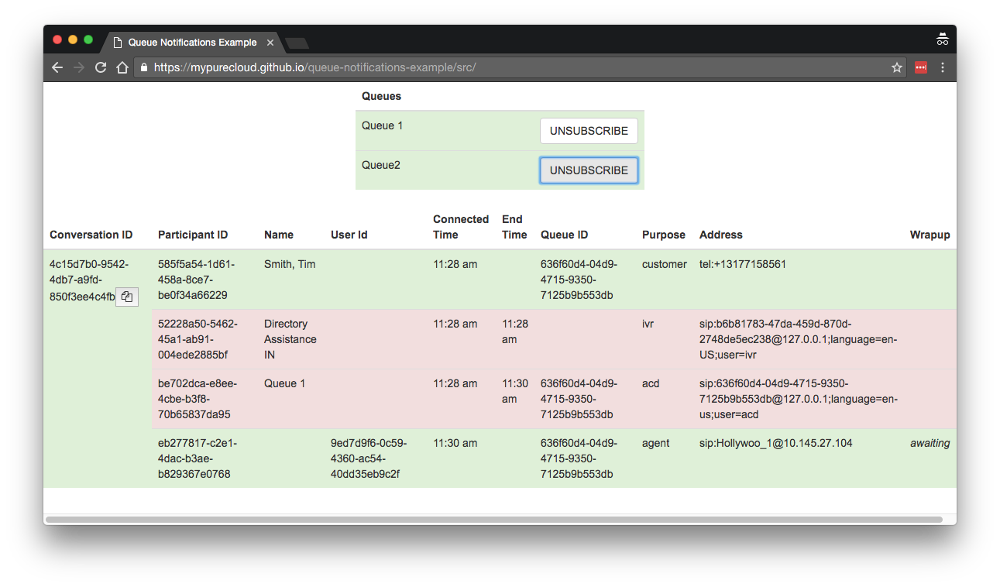

# Queue Notifications Example

# TLDR;

A web page that allows a user to subscribe to queue notificaitons and displays active conversations.

This app is also hosted on Github Pages. Try it now with your mypurecloud.com credentials at [https://mypurecloud.github.io/queue-notifications-example/src/](https://mypurecloud.github.io/queue-notifications-example/src/)

# Running the app

## Prerequisites

* [Node.js](https://nodejs.org/en/)
* [http-server](https://github.com/indexzero/http-server) node package
* SSL certificates (instructions to generate them below)
* A [PureCloud Engage](https://www.inin.com/customer-engagement/cloud-contact-center) org 
  * With a working edge for telephony
  * With at least one queue set up for inbound ACD
  * With at least one user configured to handle ACD calls from the queue

## Setup

1. Clone this repo locally
2. Generate SSL certificates for http-server to use HTTPS ([recommended tutorial](https://engineering.circle.com/https-authorized-certs-with-node-js-315e548354a2#.h7ljuzdva))
3. Install http-server globally: `npm install http-server -g`
4. Change the environment in [main.js](https://github.com/MyPureCloud/queue-notifications-example/blob/master/src/scripts/main.js#L17) if you need to connect to another PureCloud environment.
  1. If using a different environment or redirect URL, you will also need to provide your own client ID and redirect URL.
5. Run the server from the repo directory
  1. In the OSX terminal: `sh server.sh`
  2. For non-shell environments, inspect [server.sh](https://github.com/MyPureCloud/queue-notifications-example/blob/master/server.sh) to see the http-server command to start the web server. The path to the certificates and the ability to turn of HTTPS can be changed here also.

## Using the app

1. Navigate to the page: [https://localhost:8443/](https://localhost:8443/)
2. If not already authenticated, you will be redirected to log in to PureCloud.
3. The list of queues will be populated at the top of the page. Scroll through the list and click the subscribe button to subscribe to the desired queues.
4. Place calls into the queues to see the display populate.
5. Inspect the JavaScript console to see some relevant trace messages.
